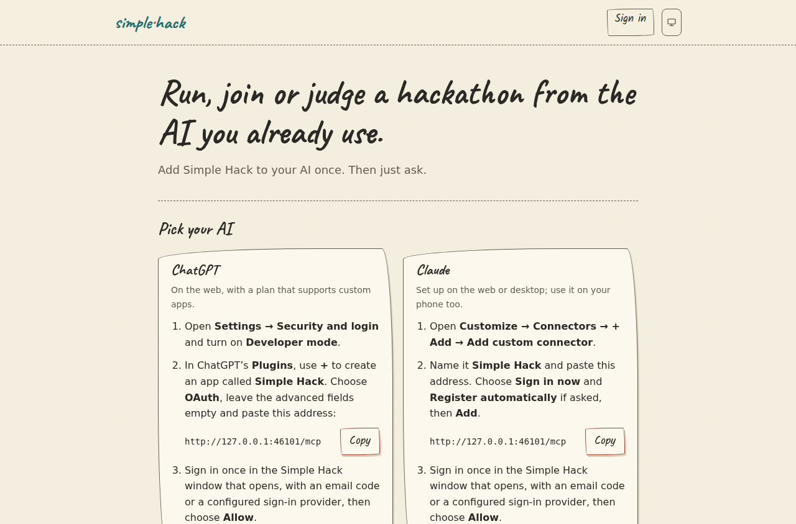

# Install the full Simple Hack platform


Simple Hack: **Hackathons, now for everyone.** Participants describe an idea to
their AI and it builds their team's site. No coding needed. The best idea wins,
not the best coder. Organisers choose the platform for college students, product
managers and leaders, and people who aren't programmers.
The full platform uses the same hand-drawn landing film, ink theme, local
Caveat/Kalam fonts and per-event crayon colours as the hosted service. At
`https://<your-domain>/get-started`, “Pick your AI” leads to the instance's own
`https://<your-domain>/mcp`, role prompts and the FAQ; skill folders and plugin
ZIPs are under “Other ways to install” and also name your instance. Use those
instance downloads rather than the hosted GitHub skills when self-hosting.
Organisers share a join link and a private judge link; participants form teams,
publish a team site and complete an entry. No account keys are handed out as
part of that onboarding.




**Release status: v0.8.5 is published.** Its default image and ZIP/tar downloads
are available from the [hack-v0.8.5 release](https://github.com/vineetu/simple-host/releases/tag/hack-v0.8.5).
The published ZIP and tarball match their checksums and each other; both CPU
images pull anonymously. A fresh local installation runs all 50 migrations. The v0.8.5 public downloads
and both images have been verified. A fresh v0.8.5 installation and an actual
v0.8.4 package/image upgrade to v0.8.5 retain event, member, entry, team key,
site files, settings and TLS CA; all 42 browser states and local Traefik routing
pass. Native runtime checks use arm64; amd64 images were pulled and their
x86-64 binary and release commit checked.
An actual v0.8.3 package/image upgrade to v0.8.4 retains the database, membership,
entry, team key, team site files, settings and TLS CA. The earlier v0.8.1-to-v0.8.2
upgrade applied six migrations (44 to 50) and retained the same data. The local
checks cover the film, ink theme, event colours, own-domain connector/examples
and local fonts at 320, 390 and 1280 px in light and dark, including a real
take-down state with no broken icon requests. The current Coolify
Compose routing also passed through real local Traefik. The live DigitalOcean installation and private snapshot
tests used
v0.8.0; [those test details](simple-hack-digitalocean.md) distinguish a private
snapshot from Marketplace approval. This package is separate from the older
Simple Host small-box installer.

One installation runs the event platform on your own domain, with its own
accounts, database and site storage. Organisers create events after signing in;
participants form teams, publish team sites, and use the event's judging and
results workflow. Nothing claims a name from simple-host.app.

| Address | What opens there |
|---|---|
| `hack.example.com` | Sign-in, events and management |
| `spring.hack.example.com` | The spring event page |
| `robot.spring.hack.example.com` | The robot team site |

## Before installing

- A Linux server with Docker Engine and the Compose plugin, Python 3, OpenSSL
  and `flock`. Start with 2 GB RAM; site storage is on its persistent disk.
- Your own domain. Point its apex and wildcard A records at the server. Check
  that both `event.<domain>` and `team.event.<domain>` resolve there. Avoid
  conflicting explicit records. Default port bindings use IPv4; remove AAAA
  records unless you also configure and verify IPv6 bindings and routing.
- Public TCP ports 80 and 443 reaching this installation; no other web server
  may already occupy them. [Coolify](simple-hack-coolify.md) uses its existing proxy.
- A Resend API key and a verified sender address. Email-code sign-in requires
  these; setting a fake key does not provide working sign-in. Google sign-in
  is optional and uses your own OAuth application and redirect configuration.

### Certificate capacity

Caddy obtains and renews an individual certificate for each requested event or
team address. No DNS provider API credentials are needed. The application
checks the requested hostname before Caddy obtains a certificate. Keep the
certificate volume during upgrades and restores.

Let's Encrypt currently permits 50 new certificates per registered domain per
seven days, shared with other applications using that registered domain.
Account for the platform, event pages and each team site before a large
event; arrange an appropriate CA rate-limit override before participants join.
This package does not install the production service's Vercel-specific
per-event wildcard issuer. An operator-managed wildcard setup is a separate
deployment requiring a certificate for each `*.<event>.<domain>`; one
`*.<domain>` certificate does not cover team addresses. Do not assume this
package automates that alternative. [CA limits](https://letsencrypt.org/docs/rate-limits/),
[Caddy on-demand TLS](https://caddyserver.com/docs/caddyfile/options).

## Install

Use a checkout or unpacked artifact from the release you intend to install.
From the repository root, create a private configuration file:

```sh
umask 077; cp deploy/hack/standalone/.env.example /tmp/simple-hack.env; ${EDITOR:-vi} /tmp/simple-hack.env
```

Set `SITE_DOMAIN`, `RESEND_API_KEY`, and `MAIL_FROM`. Leave the four secret
fields empty to generate independent values on first install. Set
`SIMPLE_HACK_IMAGE` only if using a different application image.

```sh
sudo bash deploy/hack/standalone/install.sh --config /tmp/simple-hack.env
```

The installer writes `/opt/simple-hack/.env` with mode 0600, creates an isolated
Postgres database, loads the schema and migrations, then starts the app and
Caddy. It does not print secrets. The application image and its bundled schema
must come from the same release. Container readiness is checked locally;
public DNS and trusted HTTPS still need the client checks below.

Open the configured domain, sign in by email, create an event, join it as a
participant and publish a team site. Verify the event and team site addresses
over HTTPS from another machine. `/healthz` and `/readyz` must return 200;
`/internal/tls-ask` must return 404 from the public address.

## Upgrade and persistence

Back up both named volumes: `db` holds Postgres; `data` holds team site files,
certificates and access logs. Use a logical Postgres backup plus the data
volume, or stop the installation while taking a consistent volume snapshot.
Deleting the Compose volumes deletes the installation's data.

From the new release's checkout, run its upgrade script with that release's
published image:

```sh
sudo bash deploy/hack/standalone/upgrade.sh --image ghcr.io/vineetu/simple-hack:0.8.5
```

Upgrades retain the domain, credentials, database and files. The previous environment file is kept
as `.env.previous`. The installer stops the app while applying migrations;
if migration fails, it leaves the app stopped and both volumes intact. Fix the
cause and rerun. Do not downgrade a migrated database without checking schema
compatibility or restoring a matching backup.

For additional application settings, add environment entries under both
`release` and `app` as needed in your copy of `compose.yaml`; consult
[configuration.md](../configuration.md). The bundled defaults enable the full
event platform, with 30-day archived-site retention and a warning 14 days
before removal. The site byte budget and retention values are environment
settings, not limits on event attendance.

## Build and local verification

The `hack-v0.8.5` release builds a matching base image and platform image from
one checkout and provides a ZIP or tar.gz installation package. It leaves the
older Simple Host small-box release pins intact. For a local build after that
base image exists, use the same release checkout:

```sh
docker build --build-arg SIMPLE_HOST_IMAGE=ghcr.io/vineetu/simple-host:hack-0.8.5 -f deploy/hack/standalone/Dockerfile -t simple-hack:candidate .
```

For an unpublished build, replace `SIMPLE_HOST_IMAGE` with a locally built
image containing its static binary at `/usr/local/bin/simple-host`. The schema
is copied from this checkout. Release publication must build both artifacts
from the same commit and publish the standalone image for each supported CPU.

```sh
bash deploy/hack/standalone/tests/install_test.sh
```

```sh
TEST_IMAGE=simple-hack:candidate bash deploy/hack/standalone/tests/smoke.sh
```

The smoke test uses disposable containers, loopback ports 18474–18476, a local
CA and admin-created fixture accounts. It checks fresh installation, a real
event and published team site, restart and upgrade persistence. It does not
claim production ACME issuance, browser email delivery or a cloud deployment.
Set `TEST_COOLIFY_PROXY=1` to also exercise the raw Coolify routing through a
real local Traefik container (Python's PyYAML is required). That test retains
the same event and site while replacing the direct port mapping with TLS
passthrough, checks hostname certificate refusal, visitor IP handling and
API-key log filtering, then removes its containers, network and volumes.

To test a real previous-to-current release upgrade locally, set
`TEST_PREVIOUS_IMAGE` to the previous published image and `TEST_IMAGE` to the
current image when running `tests/smoke.sh`. Set `TEST_PREVIOUS_PACKAGE` to
the previous download’s `deploy/hack/standalone` directory to use its installer
for the initial installation. `TEST_HACK_PRESENTATION=1` also
checks the film, local fonts, shared navigation and instance-specific
connector, API and skills. The fixture verifies the entry, team credential,
event settings, deployed files and local TLS CA after upgrading.
